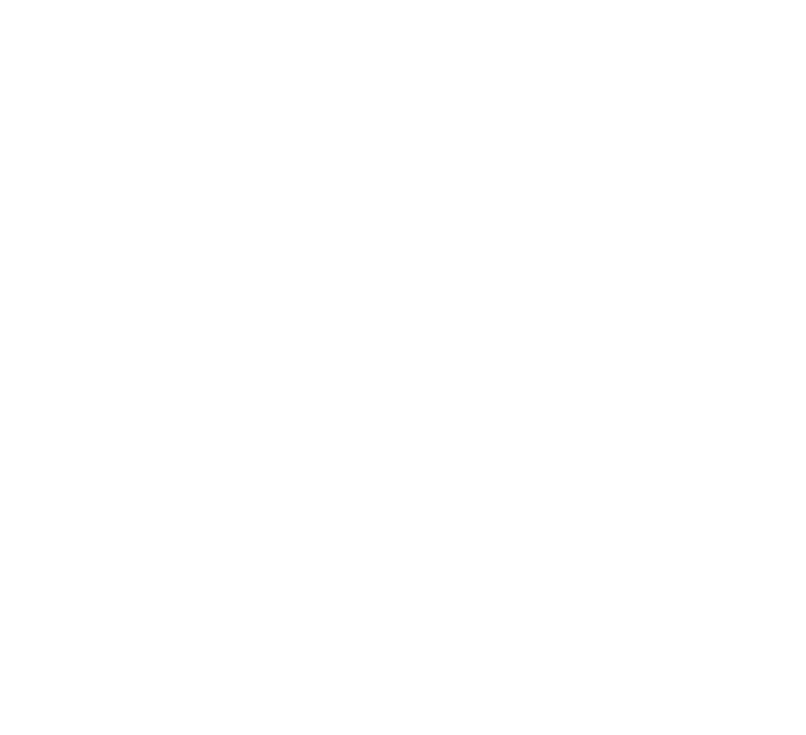

# PID Control All the Things

# Why PID?

## Proportional, Integral, Derivative

- Runs everything: quadcopters to chemical plants

- Time-tested (nothing new here!)

- Simple algorithm, easy math

- Tuning is Black Magic?  

## All About Control

- Plant: Quad, Self-Balancing Scooter, Coffee Roaster, Hot End

- Process Variable: hover height, balance, roast rate, temperature

- Setpoint and Error 

- Error = 0 as fast as possible

## Concrete Example: Monocopter

- [Ripped off of Clovis Fritzen](https://hackaday.com/2016/11/08/helicopter-pendulum-is-pid-licious/) 

- Motor and propeller on the end of a stick

- Potentiometer on the axis, hot glue

- ESP8266 ADC, Micropython

- Safety Popsicle Stick, Mark II

## My Plant the Monocopter 

- Process Variable: ADC, stand-in for the height

- Control Variable: PWM percent for motor driver

- Control Function: read in ADC, output throttle

- Non-linearities abound!   

- Also non-equilibrium system: gravity

## Proportional, Integral, Derivative

- Error: ADC - setpoint

- Output = P + I + D

- Proportional: KP * error

- Integral: KI * sum of past errors * timestep

- Derivative: KD * (this error - last error) / timestep

## Calculus?  No Thanks.

- Textbooks and continuous time

- Reality is sampled anyway: discrete time

- Sample at regular intervals, and you don't have to worry

- Multiplications, cumulative addition, and a subtract

# Let's Go!

# Tuning Tips

## Handwavy Procedure

- Start with all zeroed

- Increase KP until you get "reasonable" response

- Increase KI until it hits steady state

- At this point, could be oscillating when preturbed

- Increase KD until it's stable

- Iterate

## Time Step

- Sample regularly

- Sample often.  But not too often.

- Know your timescale, sample 10x-100x faster?

## The D Term

- Depends on timescale (dx/dt)

- Measurement with noise: high frequency / low frequency

- Limiting factor 

## Automatic Methods

-  [Ziegler–Nichols](https://en.wikipedia.org/wiki/Proportional%E2%80%93integral%E2%80%93derivative_controller#Ziegler%E2%80%93Nichols_method): the classic.  Pick KP, time oscillations.

- ZN is easy, but also aggressive / brittle

- Software solutions: if you have special needs

- Perturb +/-, watch response, optimize for what you care about

## Lag, the Killer

- Inertia in the plant

- Heavy motor, pushing air

- Limits timestep, D term

## Standard Form

- Take out a common factor of KP

- KP (1 + TI * Sum(errors) * dt + TD * (error difference)/dt)

- dt / TI is how many samples before re-centers

- TD / dt is damping time

- KI = KP / TI

- KD = KP * TD

## Loops Within Loops

- Self-balancer: balance control, angle control

- Quad: attitude control, GPS routing

- Important that outer loop runs slower (10x?) so that inner loop can react

# What Could Go Wrong?

## PID Works Best Around Equilibrium

- The plant responds differently at different setpoints

- PID is tailored for linear systems

- I term can get you there, P term can keep you there

- But what happens when out of equilibrium?

## Integral Windup

- Accumulating errors can get out of hand

- Integral term is just the constant offset

- Limit to plausible range (max, min)

- Detect special situations and turn off accumulation

## Output Range

- Nothing limits the control range to (0%, 100%)

- You might want to do so

## Derivative Kick: Change in Setpoint

- Externally change the setpoint

- Spike in the derivative

- Best solution is "derivative on measurement"

- Change error = change setpoint - change measured value

- Use negative change in process value instead of error

## Tweaking Parameters Live

- If you need to change KP or KD, no problem

- If you change KI, multiplies old values by new constant

- Solution: change errors sum proportionally

- If you increase KI by 50%, decrease error sum by 50%

# Conclusion

## PID is Hard

- All this tuning

- Need to know your plant 

- As fast as possible, as little oscillation, robust to disturbance 

- There is no _solution_ because it's not a well-defined problem

- When it goes wrong, can break things

## PID is Easy

- P fights deviations around equilibrium

- I gets equilibrium into the right place

- D damps down oscillations, lets you increase P & I

## Read More Hackaday!

{height=400px}

